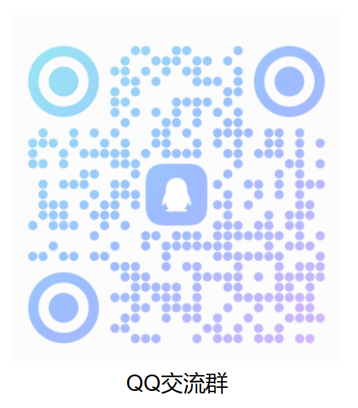

  <h1>MindSpore Technical Ecosystem Resources</h1>
  
<a href="./README_ZH.md">查看中文</a>

We provide comprehensive end-to-end learning resources——including open courses, teaching materials, application examples, competitions, certifications, and research content——to help developers learn, apply, and master MindSpore effectively. Accelerate your learning and research with practical, hands-on experience.

## 📢 News

- **Teaching Materials** —— The digital book *Artificial Intelligence: Principles and Applications*, co-developed with Professor Tonghua Su from Harbin Institute of Technology, has been officially published and is now available for online learning! ([*View details*](https://e.huawei.com/cn/talent/outPage/#/sxz-course/home?courseId=K--4yKm9T9VTCjwXOw5VyL66JpI))
- **Competitions** —— The *MindSpore Model Innovation Challenge - Season 1* is now underway, featuring a 200,000 RMB prize pool. Developers are welcome to register and participate! ([*View details*](https://www.hiascend.com/developer/contests/details/21ffd6733ab54dc4b6b686a242c5d586?module=0d9953a460e14a70be89dd6f3637f487))

- **Application Examples** —— Awesome projects from the *MindSpre Innovation Bootcamp* are continuously being updated. Stay tuned for more!

## MindSpore Resource Overview

<table>
    <tr>
        <th>No.</th>
        <th>Resources</th>
        <th>Links</th>
        <th>Committer</th>
    </tr>
    <tr>
        <td rowspan="3">1</td>
        <td rowspan="3">MindSpore Technical Open Courses</td>
        <td><a href="">Deep Learning: Principles and Practice with MindSpore</a></td>
        <td>@usrname</td>
    </tr>
    <tr>
        <td><a href="https://github.com/mindspore-courses/orange-pi-mindspore">MindSpore + Ascend Board: Hands-On Large Language Model Practice</a></td>
        <td>@usrname</td>
    </tr>
    <tr>
        <td><a href="https://github.com/mindspore-courses/step_into_llm">Special Topcis in Large Language Model</a></td>
        <td>@usrname</td>
    </tr>
    <tr>
        <td>2</td>
        <td>Application Examples</td>
        <td><a href="https://github.com/mindspore-courses/applications">Access the Repository</a></td>
        <td>@usrname</td>
    </tr>
    <tr>
        <td>3</td>
        <td>Competitions</td>
        <td><a href="https://github.com/mindspore-courses/competition">Access the Repository</a></td>
        <td>@usrname</td>
    </tr>
    <tr>
        <td>4</td>
        <td>Researches</td>
        <td></td>
        <td>@username</td>
    </tr>
    <tr>
        <td>5</td>
        <td>Teaching Materials</td>
        <td><a href="https://e.huawei.com/cn/talent/outPage/#/sxz-course/home?courseId=K--4yKm9T9VTCjwXOw5VyL66JpI">Artificial Intelligence: Principles and Applications</a></td>
        <td>-</td>
    <tr>
        <td>6</td>
        <td>MindSpore Developers and Developer Advoacates</td>
        <td><a href="https://www.mindspore.cn/developers/en">Apply for Certification</a></td>
        <td>-</td>
    </tr>

</table>

## Quick Access to MindSpore

  
  
  

## Join the Community

| |  |
| :-----------------------: | :-----------------------: |
| Add the WeChat Assistant to Join the Group | Scan to join Our QQ Group |

